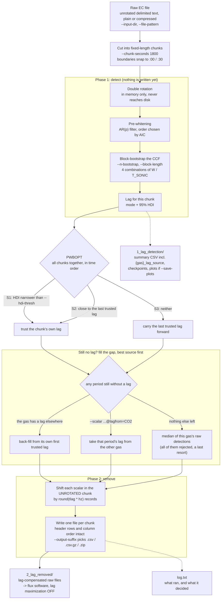

# **dyco** - dynamic lag compensation

[](https://doi.org/10.5281/zenodo.4964067)
[](https://dyco.readthedocs.io/en/latest/?badge=latest)

`dyco` takes eddy covariance raw data files as input and produces lag-compensated raw data files as
output, ready for flux calculation software such as EddyPro.

**The method is pre-whitening with block-bootstrap (PWB), following
[Vitale et al. (2024)](https://doi.org/10.1007/s10651-024-00615-9).** An AR(p) filter strips the serial
autocorrelation out of both series before the cross-correlation is computed, which sharpens a peak that
turbulence would otherwise smear. The lag is then re-estimated on block-bootstrap resamples, so each
detection carries a 95% uncertainty interval instead of a bare number. The PWBOPT decision rule reads
that interval, discards the detections it cannot trust, and puts a reliable neighbouring lag in their
place. This is what makes low-SNR gases such as N<sub>2</sub>O and CH<sub>4</sub> workable.

> **Version 3 is in development.** The working tree carries the v3 layout described below; the last
> released version on PyPI is `2.0.3`, which has a different API and depends on
> [diive](https://github.com/holukas/diive). v3 is standalone. See `CHANGELOG.md` for release status.

## Documentation

| | |
|---|---|
| [Installation](https://dyco.readthedocs.io/en/latest/install.html) | Requirements, and how to run it without your own data |
| [The terminal UI](https://dyco.readthedocs.io/en/latest/tui.html) | **Start here.** The recommended way to run dyco |
| [Command reference](https://dyco.readthedocs.io/en/latest/cli/index.html) | All four commands and every option, generated from the parsers |
| [What a run writes](https://dyco.readthedocs.io/en/latest/output.html) | Output folders, the summary CSV, `log.txt` |
| [The PWB method](https://dyco.readthedocs.io/en/latest/method.html) | Pre-whitening, block-bootstrap, PWBOPT, and the validation against RFlux |
| [Motivation and background](https://dyco.readthedocs.io/en/latest/background.html) | Why low-SNR gases need this, and the literature |
| [Migrating from v2](https://dyco.readthedocs.io/en/latest/migrating-from-v2.html) | What replaced what, and why the old method went |
| [Library API](https://dyco.readthedocs.io/en/latest/library.html) | The file splitter, wind rotation, flux detection limit |

## One detection method

v3 has a single way of finding the time lag between the vertical wind `W` and a scalar `S`: PWB. The
covariance-maximization method that `dyco` shipped up to v2 was removed; `CHANGELOG.md` records what
went and why, and `pip install dyco==2.0.3` still has it.

## Installation

Requires Python 3.12 or 3.13.

```bash
git clone https://github.com/holukas/dyco.git
cd dyco
uv sync
```

`dyco` has no dependency on `diive`. Everything it needs is bundled. See
[Installation](https://dyco.readthedocs.io/en/latest/install.html) for the rest.

## Start here: the terminal UI

```bash
dyco tui
```


*Settings on the left, the run on the right. This is `dyco tui --demo`, which needs no data.*

**This is the recommended way to run dyco.** A detect-and-remove run takes on the order of thirty
settings: column names, file format, chunk length, search windows per gas, PWBOPT thresholds. Getting
one of them wrong is easy on a command line and obvious in a form. The TUI validates as you type,
scans your first file so you can pick column names from a list instead of typing bracketed names by
hand, and runs a preflight **Check** that reads a real file and reports what it found before anything
is processed.

`dyco tui --demo` explores the interface with no data at all. More in
[The terminal UI](https://dyco.readthedocs.io/en/latest/tui.html).

## Command-line tools

Everything is reachable through one command:

```bash
dyco                    # list the workflows
dyco <command> --help   # options for one of them
```

| Command | Does | When |
|---|---|---|
| `dyco tui` | `detect-remove` behind a form, with live validation and a preflight check. | **Start here.** |
| [`dyco detect-remove`](https://dyco.readthedocs.io/en/latest/cli/detect-remove.html) | **The main command.** Split long raw files into averaging-period chunks, rotate, detect the lag per chunk, then remove it. One pass, one output folder. | Almost always. Scripting, or when you prefer a command line. |
| [`dyco pwb-batch`](https://dyco.readthedocs.io/en/latest/cli/pwb-batch.html) | Detect only, on files that are *already* split into averaging periods. Writes `tlag_results.csv` and stops. | Step 1 of the two-step route. |
| [`dyco apply-batch`](https://dyco.readthedocs.io/en/latest/cli/apply-batch.html) | Remove lags listed in an existing `tlag_results.csv`. Detects nothing. | Step 2 of the two-step route. |

Each also exists standalone: `dyco-detect-remove`, `dyco-detect-remove-tui`, `dyco-pwb-batch`,
`dyco-apply-batch`.

A gas too noisy to locate its own lag can borrow one from a reference gas in the same tube, per
period, with `--scalar "N2O:N2O_DRY_[QCL-C2]@lagfrom=CO2"`. See
[Taking a gas's lag from another gas](https://dyco.readthedocs.io/en/latest/cli/index.html#taking-a-gas-s-lag-from-another-gas).

> **Important:** downstream flux processing must run with time-lag maximization **disabled**. The lag
> has already been removed.

## Try it

A real 1-hour raw file from CH-LAE (Lägeren) ships with the repository, so the primary pipeline can be
run without supplying data:

```bash
uv run python examples/detect_remove_tlag_realdata.py
```

That detects and removes the tube delay for CO<sub>2</sub> and H<sub>2</sub>O across two 30-minute
chunks, and prints what was detected against what was actually applied. Expect about a minute.
`examples/detect_remove_tlag.py` is the synthetic counterpart, where the lag is known in advance and
can be checked.

## The PWB workflow

<!-- This flowchart is also in docs/method.md, deliberately. Kept here because
     GitHub renders mermaid natively and this is the landing page. Edit both. -->


```mermaid
flowchart TD
    RAW["Raw EC file<br/>unrotated delimited text, plain or compressed<br/>--input-dir, --file-pattern"]
    RAW --> SPLIT["Cut into fixed-length chunks<br/>--chunk-seconds 1800<br/>boundaries snap to :00 / :30"]

    subgraph P1["Phase 1: detect (nothing is written yet)"]
        direction TB
        ROT["Double rotation<br/>in memory only, never reaches disk"]
        PW["Pre-whitening<br/>AR(p) filter, order chosen by AIC"]
        BS["Block-bootstrap the CCF<br/>--n-bootstrap, --block-length<br/>4 combinations of W / T_SONIC"]
        EST["Lag for this chunk<br/>mode + 95% HDI"]
        ROT --> PW --> BS --> EST
    end

    SPLIT --> ROT

    EST --> OPT{"PWBOPT<br/>all chunks together, in time order"}
    OPT -->|"S1: HDI narrower than --hdi-thresh"| KEEP["trust the chunk's own lag"]
    OPT -->|"S2: close to the last trusted lag"| KEEP
    OPT -->|"S3: neither"| SUB["carry the last trusted lag forward"]

    KEEP --> GAP
    SUB --> GAP

    subgraph P3["Still no lag? fill the gap, best source first"]
        direction TB
        GAP{"any period still without a lag"}
        GAP -->|"the gas has a lag elsewhere"| BFILL["back-fill from its own first trusted lag"]
        GAP -->|"--scalar ...@lagfrom=CO2"| DONOR["take that period's lag from the other gas"]
        GAP -->|"nothing else left"| MED["median of this gas's raw detections<br/>(all of them rejected, a last resort)"]
    end

    BFILL --> APPLY
    DONOR --> APPLY
    MED --> APPLY

    subgraph P2["Phase 2: remove"]
        direction TB
        APPLY["Shift each scalar in the UNROTATED chunk<br/>by round(tlag * hz) records"]
        WRITE["Write one file per chunk<br/>header rows and column order intact<br/>--output-suffix picks .csv / .csv.gz / .zip"]
        APPLY --> WRITE
    end

    WRITE --> OUT["2_lag_removed/<br/>lag-compensated raw files<br/>-> flux software, lag maximization OFF"]
    EST -.-> CSV["1_lag_detection/<br/>summary CSV incl. {gas}_lag_source,<br/>checkpoints, plots if --save-plots"]
    WRITE -.-> LOG["log.txt<br/>what ran, and what it decided"]
```

Detection and removal are separate phases because PWBOPT cannot decide anything about one chunk until
it has seen the whole sequence. [The PWB method](https://dyco.readthedocs.io/en/latest/method.html) walks through each step.

## Why it exists

Covariance maximization works for compounds with high signal-to-noise ratio such as CO<sub>2</sub>.
For N<sub>2</sub>O and CH<sub>4</sub> the cross-covariance function is noisy, fluxes are biased toward
larger absolute values, and flux software falls back to a constant nominal lag that also fails when
the raw data contain systematic time shifts. `dyco` gives every detection an explicit uncertainty
interval, substitutes a trustworthy neighbouring lag where a period's own detection cannot be trusted,
and can carry a high-SNR reference gas's lag over to a low-SNR target in the same analyzer.

[Motivation and background](https://dyco.readthedocs.io/en/latest/background.html) has the full argument, two real sites where it
matters, and the references.

## Building the documentation

```bash
uv run --no-project --with-requirements docs/requirements.txt --with . sphinx-build -b html docs docs/_build/html
```

The command reference is generated from the argparse parsers, so it cannot drift from `--help`.

## Contributing

Contributions of code, bug reports, comments and general feedback are welcome and credit is always
given. See [CONTRIBUTING.md](CONTRIBUTING.md), or the
[issue tracker](https://github.com/holukas/dyco/issues).

For direct questions the maintainer can be reached by email with the title "dyco":
holukas@ethz.ch

## Acknowledgements

This work was supported by the Swiss National Science Foundation SNF (ICOS CH, grant nos.
20FI21_148992, 20FI20_173691) and the EU project Readiness of ICOS for Necessities of integrated Global
Observations RINGO (grant no. 730944).

## Notes

The JOSS paper describes `dyco` **v1.1.2**, the version released for that publication on 16 Jun 2021.
It documents the covariance-maximization method, which was removed in v3 — what the paper describes is
not what this version does. See `CHANGELOG.md`.
[](https://doi.org/10.21105/joss.02575) [](https://doi.org/10.5281/zenodo.4964067)
