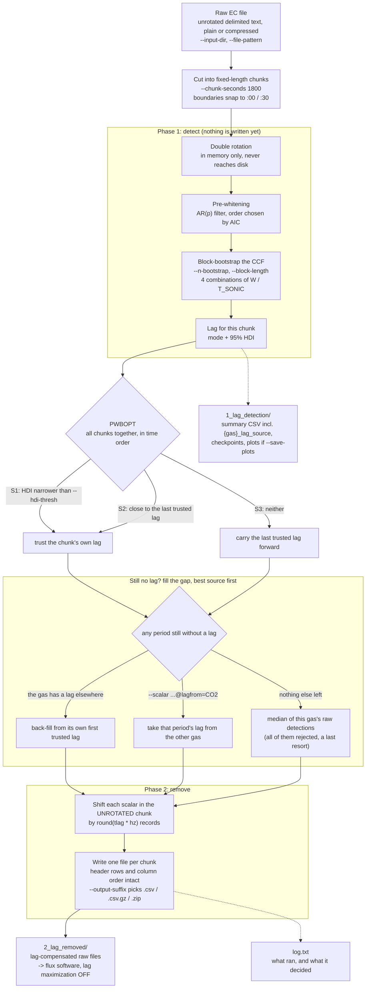

# **dyco** - dynamic lag compensation

`dyco` takes eddy covariance raw data files as input and produces lag-compensated raw data files as
output, ready for flux calculation software such as EddyPro.

**The method is pre-whitening with block-bootstrap (PWB), following
[Vitale et al. (2024)](https://doi.org/10.1007/s10651-024-00615-9).** An AR(p) filter strips the serial
autocorrelation out of both series before the cross-correlation is computed, which sharpens a peak that
turbulence would otherwise smear. The lag is then re-estimated on block-bootstrap resamples, so each
detection carries a 95% uncertainty interval instead of a bare number. The PWBOPT decision rule reads
that interval, discards the detections it cannot trust, and puts a reliable neighbouring lag in their
place. This is what makes low-SNR gases such as N<sub>2</sub>O and CH<sub>4</sub> workable.
Run it with `dyco tui`, or `dyco detect-remove` on the command line.

> **Version 3 is in development.** The working tree carries the v3 layout described below; the last
> released version on PyPI is `2.0.3`, which has a different API and depends on
> [diive](https://github.com/holukas/diive). v3 is standalone. See `CHANGELOG.md` for release status.

## One detection method

v3 has a single way of finding the time lag between the vertical wind `W` and a scalar `S`: PWB. The
covariance-maximization method that `dyco` shipped up to v2 was removed; `CHANGELOG.md` records what
went and why, and `pip install dyco==2.0.3` still has it.

## Installation

Requires Python 3.12 or 3.13.

```bash
git clone https://github.com/holukas/dyco.git
cd dyco
uv sync
```

`dyco` has no dependency on `diive`. Everything it needs is bundled.

## Start here: the terminal UI

```bash
dyco tui
```


*Settings on the left, the run on the right. This is `dyco tui --demo`, which needs no data.*

**This is the recommended way to run dyco.** A detect-and-remove run takes on
the order of thirty settings: column names, file format, chunk length, search
windows per gas, PWBOPT thresholds. Getting one of them wrong is easy on a
command line and obvious in a form. The TUI validates as you type, scans your
first file so you can pick column names from a list instead of typing bracketed
names by hand, and runs a preflight **Check** that reads a real file and reports
what it found before anything is processed. It saves and reloads settings, and
every run writes its configuration back out, so a run started in the TUI can be
repeated exactly.

`dyco tui --demo` explores the interface with no data at all.

The TUI drives one command, `dyco detect-remove`, which is the whole job in one
pass. That covers the normal case, including taking a weak gas's lag from a
strong one. See [Taking a gas's lag from another gas](#taking-a-gass-lag-from-another-gas).

The same command on the command line does everything the TUI does, and is the
right choice for scripting or a scheduler. Every TUI run writes a
`detect_remove_tui_settings.yaml` next to its results, and the TUI can reload it.
Build the configuration interactively, then automate the command.

## Command-line tools

Everything is reachable through one command:

```bash
dyco                    # list the workflows
dyco <command> --help   # options for one of them
```

| Command | Does | When |
|---|---|---|
| `dyco tui` | `detect-remove` behind a form, with live validation and a preflight check. | **Start here.** |
| `dyco detect-remove` | **The main command.** Split long raw files into averaging-period chunks, rotate, detect the lag per chunk, then remove it. One pass, one output folder. | Almost always. Scripting, or when you prefer a command line. |
| `dyco pwb-batch` | Detect only, on files that are *already* split into averaging periods. Writes `tlag_results.csv` and stops. | Step 1 of the two-step route below. |
| `dyco apply-batch` | Remove lags listed in an existing `tlag_results.csv`. Detects nothing. | Step 2 of the two-step route below. |

Each also exists standalone: `dyco-detect-remove`, `dyco-detect-remove-tui`,
`dyco-pwb-batch`, `dyco-apply-batch`.

Everything else in `dyco` is a library API with no command of its own: the file
splitter, the flux detection limit, the covariance-maximization estimator.

### Taking a gas's lag from another gas

A trace gas can be too noisy to locate its own lag. When that happens PWBOPT
rejects the detections, and the last resort is the *median of those same rejected
numbers*, which on real data is often a negative lag no tube can produce. A
reference gas travelling the same tube is a better answer.

Say so per gas, with `@lagfrom=` (**Lag from** in the TUI):

```bash
dyco detect-remove ... --scalar "CO2:CO2_DRY_[IRGA72-A]" --scalar "N2O:N2O_DRY_[QCL-C2]@lagfrom=CO2"
```

N<sub>2</sub>O keeps every lag it *can* determine for itself. Only the periods
where it cannot take the CO<sub>2</sub> lag instead, and they take it period by
period, so a donor lag that drifts is followed rather than flattened into a
constant. The summary records the choice for every period in
`{gas}_lag_source` (`own`, `from:CO2`, `median`), so a borrowed lag is never
mistaken for a detected one.

Chains work (`CH4` from `N2O` from `CO2`); circular ones are rejected.

The two-step route is still there for cases this does not cover: `pwb-batch` to
detect, then `apply-batch`, where `--scalar LABEL:column` reads the lag of one
gas and shifts the column of another. It also applies when your files are already
split into averaging periods by other software, leaving nothing for
`detect-remove` to chunk.

### A complete `detect-remove` command

This is the bundled CH-LAE example run from the command line. It processes
`examples/data/CH-LAE_202507251300.csv.gz`, one hour of 20 Hz data, gzipped, with a 3-row header,
and writes two 30-minute lag-corrected chunks:

```bash
dyco detect-remove --input-dir examples/data --output-dir ./dyco_out --file-pattern "*.csv.gz" --col-u "U_[HS50-B]" --col-v "V_[HS50-B]" --col-w "W_[HS50-B]" --col-tsonic "T_SONIC_[HS50-B]" --scalar "CO2:CO2_DRY_[IRGA72-A]" --scalar "H2O:H2O_DRY_[IRGA72-A]@lag=30;uws=30" --hz 20 --chunk-seconds 1800 --lag-max 10 --lws 0 --uws 10 --n-bootstrap 100 --skiprows 0 --extra-rows 2 --sep "," --start-time-regex "(\d{12})" --start-time-format "%Y%m%d%H%M" --chunk-name-template "CH-LAE_{starttime}{suffix}" --n-workers 4 --random-state 42
```

Reading it in groups:

| Flags | What they say |
|---|---|
| `--input-dir` `--output-dir` `--file-pattern` | Where the raw files are, where results go, which of them to take. |
| `--col-u/v/w` `--col-tsonic` | The four wind columns. `T_SONIC` is **required**, because PWB tries it as an alternative reference. |
| `--scalar LABEL:column` | One per gas, repeated. `LABEL` becomes the prefix in the results (`co2_tlag_s`). `@lag=30;uws=30` gives H<sub>2</sub>O its own wider window, since sorption on the tube walls delays it beyond the dry gases. |
| `--hz` `--chunk-seconds` | Sampling rate, and the averaging period each file is cut into. |
| `--lag-max` `--lws` `--uws` | Search window in **seconds**. `0` to `10` keeps only positive lags, because a closed-path tube delay cannot be negative. |
| `--skiprows` `--extra-rows` `--sep` | The file format. See below. |
| `--start-time-regex` `--start-time-format` `--chunk-name-template` | Read the start time out of the filename so each output chunk can be named for its own wall-clock time. |
| `--n-workers` `--random-state` | Parallelism, and a seed that makes the bootstrap reproducible. |

Output lands in two subfolders: `1_lag_detection/` (the summary CSV, a column dictionary, checkpoints,
and diagnostic plots if you pass `--save-plots`) and `2_lag_removed/` (the corrected chunks, ready to
be the input directory of the next step). A `log.txt` at the root records what ran and what it
decided; `pwb-batch` and `apply-batch` write one beside their results too. A `detect_remove_tui_settings.yaml` is written alongside
them, which `dyco tui` can load, so a command line can be inspected or re-run from the form.

### Input file formats

**The CLI and the TUI take the same format settings.** `dyco tui` is a front end over this same
parser, building its configuration from the identical arguments, so anything you can describe in the
TUI you can pass on the command line. The difference is that the TUI validates as you type and can
scan a file to show you its columns first.

| Flag | Handles |
|---|---|
| `--sep` | Field separator. `,` by default; `\t` for TSV, `\s+` for whitespace-aligned. |
| `--skiprows` | Metadata lines **before** the column-name row. `0` for a plain CSV with names on line 1; `9` for EddyPro rotated output. |
| `--extra-rows` | Rows **after** the header but before the data, such as units and instrument tags. Default `2`. They are preserved byte-for-byte in the output. |
| `--na-values` / `--na-rep` | What counts as missing on the way in, what is written for it on the way out. |
| `--lineterm` | `auto` reproduces the input's CRLF or LF. Force it with `\r\n` or `\n`. |
| `--file-pattern` | Which files to read. Compression is transparent: `.gz`, `.bz2`, `.xz` and `.zip` are read as the text they contain. |
| `--output-suffix` | The extension the written chunks carry. Give the whole thing (`.csv`, `.csv.gz`, `.dat.zip`), just the text format (`csv`, which writes plain text and drops any compression), or just the compression (`zip`, which keeps the input's text format, so `file1.csv` gives `file1.csv.zip`). `auto` (default) reuses the input's own extension. dyco decompresses the input and compresses the output from these extensions alone. This is what `{suffix}` in the name template expands to. |

Two limits worth knowing. This path reads **delimited text only**; Parquet is read by
`dyco.files.read_raw_data`, which serves the file splitter, not this pipeline. And it needs **no
data-timestamp column**: chunking is driven by `--hz` and record count, and the wall-clock time comes
from the filename via `--start-time-regex`.

### Try it

A real 1-hour raw file from CH-LAE (Lägeren) ships with the repository, so the
primary pipeline can be run without supplying data:

```bash
uv run python examples/detect_remove_tlag_realdata.py
```

That detects and removes the tube delay for CO<sub>2</sub> and H<sub>2</sub>O
across two 30-minute chunks, and prints what was detected against what was
actually applied. Set `DYCO_OUT` to a path to keep the results. Expect about a
minute. `examples/detect_remove_tlag.py` is the synthetic counterpart, where the
lag is known in advance and can be checked.

## The PWB workflow


```mermaid
flowchart TD
    RAW["Raw EC file<br/>unrotated delimited text, plain or compressed<br/>--input-dir, --file-pattern"]
    RAW --> SPLIT["Cut into fixed-length chunks<br/>--chunk-seconds 1800<br/>boundaries snap to :00 / :30"]

    subgraph P1["Phase 1: detect (nothing is written yet)"]
        direction TB
        ROT["Double rotation<br/>in memory only, never reaches disk"]
        PW["Pre-whitening<br/>AR(p) filter, order chosen by AIC"]
        BS["Block-bootstrap the CCF<br/>--n-bootstrap, --block-length<br/>4 combinations of W / T_SONIC"]
        EST["Lag for this chunk<br/>mode + 95% HDI"]
        ROT --> PW --> BS --> EST
    end

    SPLIT --> ROT

    EST --> OPT{"PWBOPT<br/>all chunks together, in time order"}
    OPT -->|"S1: HDI narrower than --hdi-thresh"| KEEP["trust the chunk's own lag"]
    OPT -->|"S2: close to the last trusted lag"| KEEP
    OPT -->|"S3: neither"| SUB["carry the last trusted lag forward"]

    KEEP --> GAP
    SUB --> GAP

    subgraph P3["Still no lag? fill the gap, best source first"]
        direction TB
        GAP{"any period still without a lag"}
        GAP -->|"the gas has a lag elsewhere"| BFILL["back-fill from its own first trusted lag"]
        GAP -->|"--scalar ...@lagfrom=CO2"| DONOR["take that period's lag from the other gas"]
        GAP -->|"nothing else left"| MED["median of this gas's raw detections<br/>(all of them rejected, a last resort)"]
    end

    BFILL --> APPLY
    DONOR --> APPLY
    MED --> APPLY

    subgraph P2["Phase 2: remove"]
        direction TB
        APPLY["Shift each scalar in the UNROTATED chunk<br/>by round(tlag * hz) records"]
        WRITE["Write one file per chunk<br/>header rows and column order intact<br/>--output-suffix picks .csv / .csv.gz / .zip"]
        APPLY --> WRITE
    end

    WRITE --> OUT["2_lag_removed/<br/>lag-compensated raw files<br/>-> flux software, lag maximization OFF"]
    EST -.-> CSV["1_lag_detection/<br/>summary CSV incl. {gas}_lag_source,<br/>checkpoints, plots if --save-plots"]
    WRITE -.-> LOG["log.txt<br/>what ran, and what it decided"]
```

Detection and removal are separate phases because PWBOPT cannot decide anything about one chunk until
it has seen the whole sequence.

### What pre-whitening and block-bootstrap do

Turbulent wind and trace-gas series are strongly autocorrelated, which broadens and distorts the peak
of the cross-correlation function and blurs the lag estimate. **Pre-whitening** fits an AR(p) filter
(order chosen by AIC) to each series so the residuals are approximately white noise, sharpening the
peak.

**Block-bootstrap** then answers a question conventional lag detection cannot: *how sure are we?*
Rather than one cross-correlation over the whole averaging period, the method draws resampled series
using overlapping blocks that preserve local autocorrelation, finds the peak lag in each, and
summarises the resulting distribution as a mode (the estimate) plus a 95% highest-density interval
(HDI). A narrow HDI means repeated resampling keeps finding the same lag.

Four cross-correlation combinations are evaluated per period, using either `W` or sonic temperature
`T_SONIC` as the reference and applying the AR filter to either the scalar or the reference. Because
`T_SONIC` and `W` are coupled through buoyant turbulence, the `T_SONIC` combinations often expose a
cleaner peak for gases whose direct scalar × `W` signal is weak. The combination with the highest
smoothed peak wins. **`T_SONIC` is required.**

### Running it

`dyco-detect-remove` works in two phases over fixed-length chunks, because a multi-hour raw file is
the wrong granularity for lag detection: both the rotation angles and the tube delay drift over hours.

**Phase 1, detect.** Each chunk is read, double-rotated in memory, and passed to the PWB detector.
Nothing is written yet. Rotation happens in memory only; the rotated data never reach disk.

**PWBOPT.** With every chunk's raw detection in hand, the S1/S2/S3 decision rule (Vitale et al. 2024,
Section 2.3) runs across the whole sequence in temporal order. A chunk with a wide HDI has an
untrustworthy mode lag, and PWBOPT replaces it with a neighbouring reliable one rather than accepting
a spurious value. That is why detection and removal are separate phases: the rule needs the full
sequence before it can decide anything.

**Phase 2, remove.** Each scalar in the **unrotated** chunk is shifted by `round(tlag * hz)` rows,
and the chunk is written out as its own file with the original header rows and column order intact.
A 6-hour input file yields up to twelve 30-minute output files. Compressed input
is read transparently, and `--output-suffix` decides how the chunks are written.

Chunk boundaries snap to the wall-clock grid (:00 / :30) when the file start time can be parsed, so
downstream software bins them correctly. A file starting off-grid produces a shorter leading chunk.

> **Important:** downstream flux processing must run with time-lag maximization **disabled**. The lag
> has already been removed.

### Per-gas search windows

Gases with different inlet geometry need different search windows. Each gas can have its own:

```bash
dyco-detect-remove --scalar "CH4:ch4" --scalar "H2O:h2o@lag=30;uws=25" --lws 0 --uws 5
```

A positive-only window keeps only physical tube delays (a closed-path delay is always > 0). A
long-inlet gas such as H<sub>2</sub>O can use a wider window than the dry gases in the same run,
which matters because EddyPro applies a single lag setting to all gases downstream. Keep the expected lag
near the middle of the window; detections pinned to a boundary are unreliable and are discarded.

### Input requirements

PWB detection needs **wind-rotation-corrected** high-frequency data. `dyco-detect-remove` handles
this itself. If you use `dyco-pwb-batch` on pre-split files, they must already be rotated (double
rotation or planar fit, e.g. EddyPro "Advanced" rotated output). A non-zero mean `W` corrupts the
cross-correlation.

## Other tools

These arrived in v3 and support the lag work, but are useful on their own.

### Splitting and rotating raw files

`FileSplitter` / `FileSplitterMulti` divide long raw files into shorter time-based parts, optionally
applying double rotation and writing the turbulent departures alongside. Output as CSV (optionally
gzipped) or Parquet.

```python
from dyco.split import FileSplitterMulti
```

### Wind rotation

`WindDoubleRotation` and `reynolds_decomposition`: double rotation for sonic anemometer tilt
correction, and turbulent departures `x' = x - mean(x)`.

```python
from dyco.rotation import WindDoubleRotation, reynolds_decomposition
```

### Flux detection limit

`FluxDetectionLimit` estimates the smallest flux distinguishable from noise, following Langford et al.
(2015). It reads the noise from the far tail of the same cross-covariance function used for lag
detection, which is why it lives here.

```python
from dyco.detectionlimit import FluxDetectionLimit
```

## Motivation

Detecting the lag between the turbulent departures of measured wind and the scalar of interest is a
central step in calculating eddy covariance ecosystem fluxes. When covariance maximization fails to
find a clear peak, flux software falls back to a constant nominal lag. But both finding a clear peak
and choosing a reliable default are hard for compounds with low signal-to-noise ratio such as
N<sub>2</sub>O. One static default also produces poor results when the raw data contain systematic
time shifts.

`dyco` assists flux processing software for exactly these compounds. It offers:

- a lag estimate with an explicit uncertainty interval, so unreliable detections can be identified
  rather than silently accepted, and a decision rule that substitutes a trustworthy neighbouring lag
  when a period's own detection cannot be trusted
- lags detected on a high-SNR *reference* gas used for a low-SNR *target* measured by the same
  analyzer, where the target cannot determine its own. See
  [Taking a gas's lag from another gas](#taking-a-gass-lag-from-another-gas)
- dynamic compensation across raw files, so a lag that drifts (from an unsynchronized instrument
  clock, say) is followed period by period instead of averaged away

The output is lag-removed files usable directly in flux calculation software.

## Scientific background

In ecosystem research the EC method is widely used to quantify biosphere-atmosphere exchange of
greenhouse gases and energy (Aubinet et al., 2012; Baldocchi et al., 1988). The raw flux is the
covariance between the turbulent vertical wind measured by a sonic anemometer and the entity of
interest measured by a gas analyzer. Because two instruments are involved, wind and gas are not
recorded at the same instant, producing a time lag that must be quantified and corrected or fluxes are
systematically biased. Lags are conventionally estimated by finding maximum absolute covariance within
a window of physically possible lags (e.g., McMillen, 1988; Moncrieff et al., 1997).

This works for compounds with high SNR such as CO<sub>2</sub>. For low-SNR compounds such as
N<sub>2</sub>O and CH<sub>4</sub> the cross-covariance function is noisy, and fluxes are biased toward
larger absolute values (Langford et al., 2015), making annual GHG budgets harder to calculate
accurately.

There are two responses to this. One is to detect the lag for a high-SNR *reference* compound and
apply it to the low-SNR *target* measured by the same analyzer (Nemitz et al., 2018), which `dyco`
supports by pairing one gas's lag with another gas's column at the removal step. The other is to
improve the estimate itself: pre-whitening sharpens the cross-correlation peak by removing serial
autocorrelation, and block-bootstrap resampling quantifies how reproducible the resulting lag is
(Vitale et al., 2024). The second is the method `dyco` implements as of v3.

## Real-world examples

The [ICOS](https://www.icos-cp.eu/) Class 1
site [Davos](https://www.swissfluxnet.ethz.ch/index.php/sites/ch-dav-davos/site-info-ch-dav/) (CH-Dav),
a subalpine forest in eastern Switzerland, holds one of the longest continuous flux records globally
(24 years and running). Since 2016 N<sub>2</sub>O has been measured by a closed-path analyzer that also
records CO<sub>2</sub>. Air sampled by the analyzer takes time to travel from the tube inlet to the
measurement cell, so the gas signal lags the wind. Covariance maximization handles CO<sub>2</sub> well
but mostly fails for N<sub>2</sub>O, whose cross-correlation function is noisy, giving noisy fluxes.
Since N<sub>2</sub>O has adsorption/desorption characteristics similar to CO<sub>2</sub>, both need
roughly the same travel time, so `dyco` can detect lags on CO<sub>2</sub> and remove them from
N<sub>2</sub>O. Once the tube delay is out of the files, the remaining wind-to-N<sub>2</sub>O lag sits
near zero, which makes a small window or a constant lag viable during flux calculation.

Another case is managed grassland, where N<sub>2</sub>O exchange is dominated by sporadic
high-emission events (e.g., Hörtnagl et al., 2018; Merbold et al., 2014). Large quantities are emitted
during and after fertilizer application and ploughing, but between those events fluxes stay low, often
below the analyzer's detection limit. Flux calculation works during high-emission periods (high SNR)
and struggles the rest of the year. Here too, lags from a *reference* gas in the same analyzer
(CO<sub>2</sub>, CO, CH<sub>4</sub>) can be removed from the N<sub>2</sub>O data.

## Contributing

All contributions in the form of code, bug reports, comments or general feedback are always welcome and
greatly appreciated! Credit will always be given.

- **Pull requests**: If you added new functionality or made the `dyco` code run faster (always
  welcome), please create a fork in GitHub, make the contribution public in your repo and then issue
  a [pull request](https://docs.github.com/en/github/collaborating-with-issues-and-pull-requests/creating-a-pull-request-from-a-fork).
  Please include tests in your pull requests.
- **Issues**: If you experience any issue, please use
  the [issue tracker](https://github.com/holukas/dyco/issues) to submit it as an issue ticket with the
  label 'bug'. Please also include a minimal code example that produces the issue.
- **Feature request**: If there is a feature that you would like to see in a later version, please use
  the [issue tracker](https://github.com/holukas/dyco/issues) to submit it as an issue ticket with the
  label 'feature request'.
- **Contact details**: For direct questions or enquiries the maintainer of this repository can be
  contacted directly by writing an email with the title "dyco" to: holukas@ethz.ch

## Acknowledgements

This work was supported by the Swiss National Science Foundation SNF (ICOS CH, grant nos.
20FI21_148992, 20FI20_173691) and the EU project Readiness of ICOS for Necessities of integrated Global
Observations RINGO (grant no. 730944).

## Notes

A previous version of `dyco` was used in a publication in JOSS.
[](https://doi.org/10.21105/joss.02575) [](https://zenodo.org/badge/latestdoi/311300577)

## References

Aubinet, M., Vesala, T., Papale, D. (Eds.), 2012. Eddy Covariance: A Practical Guide to Measurement and
Data Analysis. Springer Netherlands, Dordrecht. https://doi.org/10.1007/978-94-007-2351-1

Baldocchi, D.D., Hincks, B.B., Meyers, T.P., 1988. Measuring Biosphere-Atmosphere Exchanges of
Biologically Related Gases with Micrometeorological Methods. Ecology 69,
1331–1340. https://doi.org/10.2307/1941631

Hörtnagl, L., Barthel, M., Buchmann, N., Eugster, W., Butterbach-Bahl, K., Díaz-Pinés, E., Zeeman, M.,
Klumpp, K., Kiese, R., Bahn, M., Hammerle, A., Lu, H., Ladreiter-Knauss, T., Burri, S., Merbold, L.,
2018. Greenhouse gas fluxes over managed grasslands in Central Europe. Glob. Change Biol. 24,
1843–1872. https://doi.org/10.1111/gcb.14079

Langford, B., Acton, W., Ammann, C., Valach, A., Nemitz, E., 2015. Eddy-covariance data with low
signal-to-noise ratio: time-lag determination, uncertainties and limit of detection. Atmospheric Meas.
Tech. 8, 4197–4213. https://doi.org/10.5194/amt-8-4197-2015

McMillen, R.T., 1988. An eddy correlation technique with extended applicability to non-simple terrain.
Bound.-Layer Meteorol. 43, 231–245. https://doi.org/10.1007/BF00128405

Merbold, L., Eugster, W., Stieger, J., Zahniser, M., Nelson, D., Buchmann, N., 2014. Greenhouse gas
budget (CO<sub>2</sub>, CH<sub>4</sub> and N<sub>2</sub>O) of intensively managed grassland following
restoration. Glob. Change Biol. 20, 1913–1928. https://doi.org/10.1111/gcb.12518

Moncrieff, J.B., Massheder, J.M., de Bruin, H., Elbers, J., Friborg, T., Heusinkveld, B., Kabat, P.,
Scott, S., Soegaard, H., Verhoef, A., 1997. A system to measure surface fluxes of momentum, sensible
heat, water vapour and carbon dioxide. J. Hydrol. 188–189,
589–611. https://doi.org/10.1016/S0022-1694(96)03194-0

Nemitz, E., Mammarella, I., Ibrom, A., Aurela, M., Burba, G.G., Dengel, S., Gielen, B., Grelle, A.,
Heinesch, B., Herbst, M., Hörtnagl, L., Klemedtsson, L., Lindroth, A., Lohila, A., McDermitt, D.K.,
Meier, P., Merbold, L., Nelson, D., Nicolini, G., Nilsson, M.B., Peltola, O., Rinne, J., Zahniser, M.,
2018. Standardisation of eddy-covariance flux measurements of methane and nitrous oxide. Int.
Agrophysics 32, 517–549. https://doi.org/10.1515/intag-2017-0042

Vitale, D., Fratini, G., Helfter, C., Hörtnagl, L., et al., 2024. A pre-whitening with block-bootstrap
cross-correlation procedure for temporal alignment of data sampled by eddy covariance systems. Environ.
Ecol. Stat. 31, 219–244. https://doi.org/10.1007/s10651-024-00615-9
