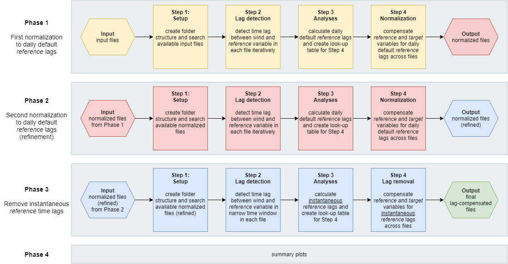
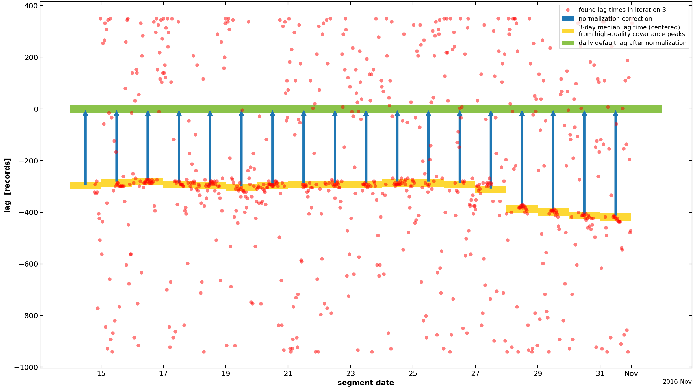

# Summary

In ecosystem research, the eddy covariance (EC) method is widely used to quantify the biosphere-atmosphere exchange of greenhouse gases (GHGs) and energy [@Aubinet2012; @Baldocchi1988]. The raw ecosystem flux (i.e. net exchange) is calculated by the covariance between the turbulent vertical wind component measured by a sonic anemometer and the entity of interest, e.g. CO2, measured by a gas analyzer. Due to the application of two different instruments, wind and gas are not recorded at exactly the same time, resulting in a time lag between the two time series. For the calculation of ecosystem fluxes this time delay has to be quantified and corrected for, otherwise fluxes are systematically biased. Time lags for each averaging interval can be estimated by finding the maximum absolute covariance between the two turbulent time series at different time steps in a pre-defined time window of physically possible time-lags  [e.g., @McMillen1988; @Moncrieff1997]. Lag detection works well when processing fluxes for compounds with high signal-to-noise ratio (SNR), which is typically the case for e.g. CO2. In contrast, for compounds with low SNR (e.g., N2O, CH4) the cross-covariance function with the turbulent wind component yields noisier results and calculated fluxes are biased towards larger absolute flux values [@Langford2015], which in turn renders the accurate calculation of yearly ecosystem GHG budgets more difficult and results may be inaccurate.

One suggestion to adequately calculate fluxes for compounds with low SNR is to first calculate the time lag for a *reference* compound with high SNR (e.g. CO2) and then apply the same time lag to the *target* compound of interest (e.g. N2O), with both compounds being recorded by the same analyzer [@Nemitz2018]. `DYCO` follows up on this suggestion by facilitating the dynamic lag-detection between the turbulent wind data and a *reference* compound and the subsequent application of found *reference* time lags to one or more *target* compounds. 

# Statement of need

The lag detection between the turbulent departures of measured wind and the scalar of interest is a central step in the calculation of EC ecosystem fluxes. In case the covariance maximization fails to detect a clear peak in the covariance function between the wind and the scalar, current flux calculation software can apply a constant default (nominal) time lag to the respective scalar. However, both the detection of clear covariance peaks in a pre-defined time window and the definition of a reliable default time lag is challenging for compounds which are often characterized by low SNR, such as N2O. In addition, the application of one static default time lag may produce inaccurate results in case systematic time shifts are present in the raw data.

 `DYCO` is meant to assist current flux processing software in the calculation of fluxes for compounds with low SNR. In the context of current flux processing schemes, the unique features offered as part of the `DYCO` package include:

- (i) the dynamic application of progressively smaller time windows during lag search for a *reference* compound (e.g. CO2),
- (ii) the calculation of default time lags on a daily scale for the *reference* compound,
- (iii) the application of daily default *reference* time lags to one or more *target* compounds (e.g. N2O)
- (iv) the dynamic normalization of time lags across raw data files,
- (v) the automatic correction of systematic time shifts in *target* raw data time series, e.g. due to failed synchronization of instrument clocks, and
- (vi) the application of instantaneous *reference* time lags, calculated from lag-normalized files, to one or more *target* compounds.

As `DYCO` aims to complement current flux processing schemes, final lag-removed files are produced that can be directly used in current flux calculation software.

# Processing chain

**Figure 1.** *The DYCO processing chain.*

The full `DYCO` processing chain comprises four phases and several iterations during which *reference* lags are refined iteratively in progressively smaller search windows (Figure 1). 

Generally, the *reference* lag search is facilitated by prior normalization of default (nominal) time lags across files. This is achieved by compensating *reference* and *target* time series data for daily default *reference* lags, calculated from high-quality *reference* lags available around the respective date (Figure 2). Due to this normalization, *reference* lags fall into a specific, pre-defined and therefore known time range, which in turn allows the application of increasingly narrower time windows during lag search. This approach has the advantage that *reference* lags can be calculated from a *reference* signal that shows clear peaks in the cross-covariance analysis with the wind data and thus yields unambiguous time lags due to its high SNR. In case the lag search failed to detect a clear time delay for the *reference* variable (e.g. during the night), the respective daily default *reference* lag is used instead. *Reference* lags can then be used to compensate *target* variables with low SNR for detected *reference* time delays. 

**Phase 1** uses the original input files and removes the daily default *reference* lag from *reference* and *target* variables, producing lag-normalized files. This is achieved by first calculating the time lag between the turbulent fluctuations of the vertical wind and the turbulent measurements of the *reference* variable (e.g. atmospheric CO2) by covariance maximization. The time window for this lag search is iteratively narrowed down (default 3 iterations). Detected time lags are analyzed and daily default *reference* lags are calculated from a selection of high-quality covariance peaks found around the respective date. The *reference* variable and *target* variables are then compensated for found daily default *reference* lags by shifting time series data accordingly. At the same time `DYCO` removes systematic shifts from the data, i.e. after normalization all lags are found in the same time range (Figure 2). Finally, the shifted data are saved to new files.

**Phase 2** comprises the exact same processing steps as Phase 1, with the  difference that instead of the original input files the normalized files produced during Phase 1 are used. In essence, Phase 2 refines *reference* results from Phase 1. Since the *reference* time series data were already compensated for daily default *reference* lags during the previous phase, Phase 2 can apply a much narrower time window during *reference* lag search. 

**Phase 3** detects the final instantaneous lags between the turbulent wind and the *reference* variable. Due to the compensation for daily default time lags in preceding Phases, instantaneous lags for each time period are now found close to zero. Therefore, a narrow window of +/- 100 records can be applied for the final lag search. Lags found within the acceptance limit of +/- 50 records are selected as the final instantaneous *reference* lag for the respective time period. For time periods with lags outside the acceptance limits, the final instantaneous *reference* lag is set to zero. Final instantaneous *reference* time lags are then applied to the *target* variables and lag-compensated files are produced.

**Phase 4** finalizes the processing chain by producing additional plots. 

**Figure 2**. *Example showing the normalization of default reference time lags across files. Shown are found instantaneous time lags (red) between turbulent wind data and turbulent CO2 mixing ratios, calculated daily reference default lags (yellow bars), normalization correction (blue arrows) and the daily default reference lag after normalization (green bar). Negative lag values mean that the CO2 signal was lagged behind the wind data, e.g. -400 means that the instantaneous CO2 records arrived 400 records (corresponds to 20s in this example) later at the analyzer than the wind data. Daily default reference lags were calculated as the 3-day median time lag from a selection of high-quality time lags, i.e. when cross-covariance analyses yielded a clear covariance peak. The normalization correction is applied dynamically to shift the CO2 data so that the default time lag is found close to zero across files. Note the systematic shift in time lags starting after 27 Oct 2016.*

# Real-world examples

The [ICOS](https://www.icos-cp.eu/) Class 1 site [Davos](https://www.swissfluxnet.ethz.ch/index.php/sites/ch-dav-davos/site-info-ch-dav/) (CH-Dav), a subalpine forest ecosystem station in the east of Switzerland, provides one of the longest continuous time series (24 years and running) of ecosystem fluxes globally. Since 2016, measurements of the strong GHG N2O are recorded by a closed-path gas analyzer that also records CO2. To calculate fluxes using the EC method, wind data from the sonic anemometer is combined with instantaneous gas measurements from the gas analyzer. However, the air sampled by the gas analyzer needs a certain amount of time to travel from the tube inlet to the measurement cell in the analyzer and is thus lagged behind the wind signal. The lag between the two signals needs to be compensated for by detecting and then removing the time lag at which the cross-covariance between the turbulent wind and the turbulent gas signal reaches the maximum absolute value. This works generally well when using CO2 (high SNR) but is challenging for N2O (low SNR). Performing the lag detection on wind and N2O data yields noisy time lags and the true lag remains unknown. However, since N2O has similar adsorption / desorption characteristics as CO2 it is valid to assume that both compounds need approx. the same time to travel through the tube to the analyzer, i.e. the time lag for both compounds in relation to the wind is similar. Therefore, `DYCO` can be applied (i) to calculate time lags across files for CO2 (*reference* compound), and then (ii) to remove found CO2 time delays from the N2O signal (*target* compound). After lag compensation, wind records are correctly matched with instantaneous N2O records and the ecosystem flux can be calculated more accurately.

Another application example are managed grasslands where the biosphere-atmosphere exchange of N2O is often characterized by sporadic high-emission events [e.g., @Hoertnagl2018; @Merbold2014]. While high N2O quantities can be emitted during and after management events such as fertilizer application and ploughing, fluxes in between those events typically remain low and often below the limit-of-detection of the applied analyzer. In this case, calculating N2O fluxes works well during the high-emission periods (high SNR) but is challenging during the rest of the year (low SNR). Here, `DYCO` can be used to first calculate time lags for a *reference* gas measured in the same analyzer (e.g. CO2, CO, CH4)  and then remove *reference* time lags from the N2O data.

# Acknowledgements

This work was supported by the Swiss National Science Foundation SNF (ICOS CH, grant nos. 20FI21_148992, 20FI20_173691) and the EU project Readiness of ICOS for Necessities of integrated Global Observations RINGO (grant no. 730944).

# References
